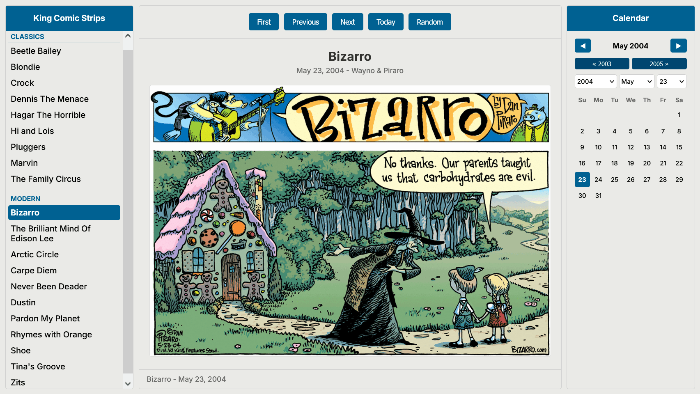

# Comics Kingdom Easy Browser

This is the sibling of the web version of the [Comic Strip Browser for GoComics](https://github.com/DerLudditus/comic-strip-browser-web), which needed a counterpart for ComicsKingdom.com, which hosts the comics syndicated through King Features Syndicate, Inc.

:white_check_mark: If you have Python installed locally so that a tiny proxy server can be launched, then you only need a browser. :point_down:

:rocket: [**comics-kingdom-easy-browser-python**](./comics-kingdom-easy-browser-python)

:white_check_mark: If you have a WordPress installation somewhere, you can upload a PHP version there and access it with a browser. :point_down:

:rocket: [**comics-kingdom-easy-browser-wordpress**](./comics-kingdom-easy-browser-wordpress)

A completely server-free (proxy-free) HTML+JS version cannot be made due to CORS limitations.

### Supported Comic Strips

Only a small selection of the comics available in free access is supported. I'm afraid it has to do with personal preferences, but not only that.

Should you follow Joshua Fruhlinger's [The Comics Curmudgeon](https://joshreads.com/), you'll notice that there are many other titles worth reading. However, famous great titles like the following ones never make sense when you only read the panels for a day; they're serials or feuilletons:

- Dick Tracy
- Judge Parker
- Mary Worth
- Rex Morgan, M.D.
- The Phantom

So I decided against including any of them. Feel free to change the selection yourself, but as is, these are the comics supported by the app:

### CLASSICS
1. **Beetle Bailey**
2. **Blondie**
3. **Crock**
4. **Dennis The Menace**
5. **Hagar The Horrible**
6. **Hi and Lois**
7. **Pluggers**
8. **Marvin**
9. **The Family Circus**

### MODERN
10. **Bizarro**
11. **The Brilliant Mind Of Edison Lee**
12. **Arctic Circle**
13. **Carpe Diem**
14. **Never Been Deader**
15. **Dustin**
16. **Pardon My Planet**
17. **Rhymes with Orange**
18. **Shoe**
19. **Tina's Groove**
20. **Zits**

It is **not** without :bug: bugs, but once you get used to the various buttons, you can work around them. 

Some comic titles, especially in their early days, can have gaps in availability (see below): usually they can be weekly instead of daily. In such cases, with `Next`/`Previous`, the app iterates a number of days, after which, if it stops without having found anything, you select another date yourself. 

There are two types of calendars:

- The large, clickable one (the arrows also work!) with buttons to navigate by month or by year.
- The dropdown-based one, meant for quick direct navigation to a desired date.

There are some bugs related to the interaction between these two calendars and between them and the top navigation buttons (`First`, `Previous`, `Next`, `Today`, `Random`). Nothing that could kill you, though. 

On your keyboard, `Home`/`End` mean `First`/`Today`.

### Gaps in Comics

- **Beetle Bailey** starts on 1996-01-07 initially on a weekly base, then daily since 1998-10-04.
- **Crock**  starts on 1996-01-07 initially on a weekly base, then daily since 1998-10-04.
- **Dennis The Menace** starts on 1985-12-28 but after that first day, it goes on a weekly base since 1996-01-07, then daily since 1998-10-04.
- **Hi and Lois** starts on 1996-01-07 initially on a weekly base, then daily since 1998-10-04.
- **Marvin** starts on 1996-01-07 initially with a 2-week jump to 1996-01-21, then weekly, then daily since 1998-10-04.
- **The Family Circus** starts on 1996-01-07 initially on a weekly base, then daily since 1998-10-04.
- **Bizarro** starts on 1996-02-04 innitially irregularly (1996-02-18, 1996-03-03, 1996-03-31, 1996-04-07) but then weekly since 1996-04-07 and daily since 2002-12-29.
- **Rhymes with Orange** starts on 1993-08-28, but the second strip, from which it is daily, is on 1995-06-19.
- **Tina’s Groove** starts on 2002-03-31 initially on a weekly base, then daily since 2002-07-01.
- **Zits** starts on 1997-07-13 initially on a weekly base, then daily since 1998-10-04.

October 4, 1998, seems to have been a turning point for many comics.

### Scaling Hack

The following 6 comics have automatic scaling applied when they are very large:
- **Dennis The Menace**
- **Pluggers**
- **The Family Circus**
- **Bizarro**
- **Carpe Diem**
- **Never Been Deader**
- **Pardon My Planet**

These comics are scaled to 50% of their original size only when both width > 1500px AND height > 1800px.

**Tip**: Otherwise, whenever the user encounters an image that's excessively high, the following workaround is recommended: unmaximize the browser, then reduce its width until the displayed image scales down.

### For more technical details, consult the README file for each of the two versions!

:writing_hand: You can add comments [on my blog](https://ludditus.com/2025/11/16/comics-kingdom-easy-browser/).
